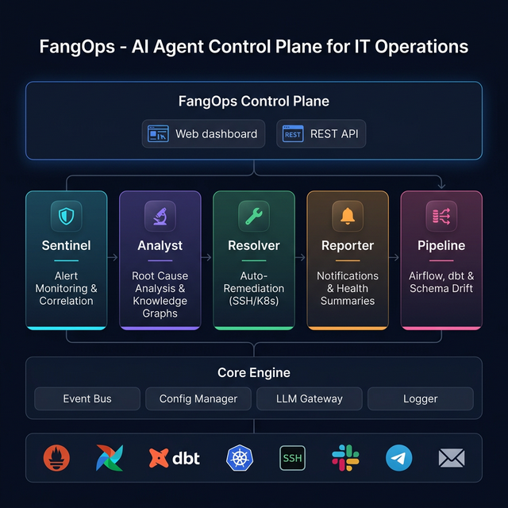

# FangOps

> AI Agent Control Plane for IT Operations — Self-hosted, Open-source

[](https://opensource.org/licenses/MIT)
[](https://nodejs.org)
[](https://www.typescriptlang.org/)

**FangOps** is a self-hosted AI Agent Control Plane that replaces your fragmented monitoring stack (ServiceNow + PagerDuty + Datadog) with a single unified platform. Five autonomous AI agents — called **Hands** — monitor your infrastructure, correlate alerts, perform root cause analysis, auto-remediate known issues, and send notifications — all without waking up your on-call engineer at 3am.

## Live Demo

Try FangOps right now — no setup required:

| | URL |
|---|---|
| **Dashboard** | [fangops-dashboard-4xnkq2yqlq-uc.a.run.app](https://fangops-dashboard-4xnkq2yqlq-uc.a.run.app) |
| **API** | [fangops-api-4xnkq2yqlq-uc.a.run.app](https://fangops-api-4xnkq2yqlq-uc.a.run.app) |

Click **"Try Live Demo"** on the login page for instant read-only access.

## Architecture



## Key Features

- **AI-Powered Alert Correlation** — Sentinel Hand ingests Prometheus alerts, deduplicates noise, and uses LLMs to classify severity and correlate related alerts into incidents.

- **Automated Root Cause Analysis** — Analyst Hand performs LLM-driven root cause analysis, generates postmortems, and builds knowledge graphs from past incidents for faster future resolution.

- **Tiered Auto-Remediation** — Resolver Hand executes fixes via SSH and Kubernetes adapters, with three trust tiers:
  - *Safe*: Auto-executes (pod restarts, log cleanup)
  - *Approval*: Proposes fix, waits for human approval
  - *Manual*: Notifies only, provides analysis

- **Multi-Channel Notifications** — Reporter Hand sends real-time alerts and daily health summaries via Slack, Telegram, and Email.

- **Data Pipeline Monitoring** — Pipeline Hand monitors Airflow DAGs, dbt models, and detects schema drift — connecting infrastructure and data reliability in one platform.

## Quick Start

### Prerequisites

- Node.js 20+
- pnpm 9+

### Development

```bash
git clone https://github.com/Ankit240619/FangOps.git
cd FangOps
pnpm install
cp .env.example .env    # Configure your API keys
pnpm dev                # Starts API + Dashboard
```

- **API**: http://localhost:3000 (health endpoint: `/health`)
- **Dashboard**: http://localhost:5173
- **Login**: `admin@fangops.local` / `admin`

### Docker

```bash
docker compose -f docker/docker-compose.yml up -d
```

| Service | URL | Description |
|---------|-----|-------------|
| API | http://localhost:3000 | FangOps REST API |
| Dashboard | http://localhost:5173 | React Web UI |
| Prometheus | http://localhost:9090 | Metrics collection |
| Grafana | http://localhost:3001 | Metrics dashboards |
| MailHog | http://localhost:8025 | Email testing UI |

## Project Structure

```
packages/
  core/             Shared types, config, event bus, LLM gateway, logger
  api/              REST API server (Fastify + SQLite + Drizzle ORM)
  dashboard/        Web dashboard (React + Vite + Recharts)
  hands/
    sentinel/       Monitoring, alert ingestion & correlation
    reporter/       Notifications (Slack, Telegram, Email) & daily summaries
    resolver/       Auto-remediation via SSH & Kubernetes adapters
    analyst/        Root cause analysis, postmortems & knowledge graphs
    pipeline/       Airflow, dbt & schema drift detection
docker/             Dockerfile, docker-compose, Prometheus config
scripts/            Setup & seed scripts
.github/            CI/CD workflows (GitHub Actions)
```

## Tech Stack

| Layer | Technology |
|-------|-----------|
| Runtime | Node.js 20, TypeScript 5.9 |
| API | Fastify, JWT authentication, Zod validation |
| Database | SQLite (via better-sqlite3) + Drizzle ORM |
| Dashboard | React 19, Vite 7, Recharts, Lucide icons |
| AI/LLM | OpenAI, Anthropic, Google Gemini, Ollama (local) |
| Infrastructure | Docker, Cloud Run, GitHub Actions CI/CD |
| Monitoring | Prometheus integration |
| Orchestration | Airflow adapter, dbt adapter |

## Configuration

Copy `.env.example` to `.env` and configure:

```bash
# Required
JWT_SECRET=your-secret-key

# LLM Provider (at least one required for AI features)
OPENAI_API_KEY=sk-...
# or
ANTHROPIC_API_KEY=sk-ant-...
# or
OLLAMA_BASE_URL=http://localhost:11434  # Free, local LLM

# Optional: Notification channels
SLACK_WEBHOOK_URL=https://hooks.slack.com/services/...
TELEGRAM_BOT_TOKEN=your-bot-token
SMTP_HOST=smtp.gmail.com
```

## Development Commands

```bash
pnpm install          # Install all dependencies
pnpm build            # Build all packages
pnpm test             # Run test suites
pnpm dev              # Start development servers
pnpm typecheck        # TypeScript type checking
```

## API Endpoints

| Method | Endpoint | Description |
|--------|----------|-------------|
| GET | `/health` | Health check |
| GET | `/api/v1/info` | System info |
| POST | `/api/v1/auth/login` | Authenticate |
| POST | `/api/v1/auth/register` | Create user (admin only) |
| GET | `/api/v1/alerts` | List alerts |
| POST | `/api/v1/alerts/webhook` | Ingest webhook alerts |
| GET | `/api/v1/incidents` | List incidents |
| GET | `/api/v1/incidents/:id/timeline` | Incident timeline |
| GET | `/api/v1/remediation` | Remediation actions |
| GET | `/api/v1/pipelines/health` | Pipeline health status |

## License

MIT License - see [LICENSE](LICENSE) for details.

---

Built by [Ankit](https://github.com/Ankit240619)
